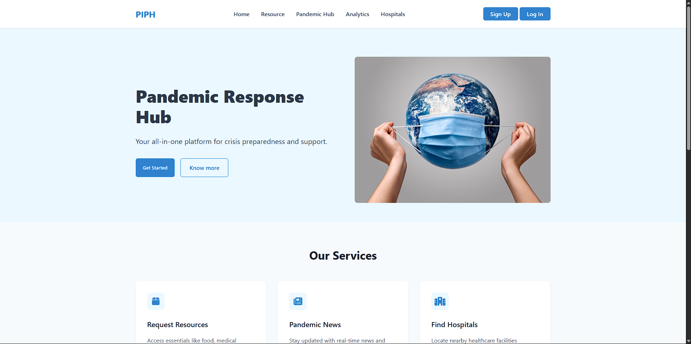

# Pandemic Insights and Preparedness Hub

  

## Live Demo
[Click here to visit the live site](https://pandemic-insights-and-prepareness-hub-piph-rmk7.vercel.app/)

## Repository
[GitHub Repository](https://github.com/YashSachdeva/PIPH_Pandemic-Insights-and-Preparedness-Hub)

## About the Project
The **Pandemic Insights and Preparedness Hub** is a real-time dashboard providing crucial data and tools to help individuals, organizations, and governments respond to pandemics effectively. The platform integrates live statistics, predictive analytics, resource allocation, and volunteer coordination for a comprehensive response system.

## Features
- **Real-time Pandemic Dashboard** – Displays live pandemic statistics with interactive charts and visualizations.
- **Hospital & Resource Locator** – Maps nearby healthcare facilities and available resources.
- **Volunteer System** – Connects users to volunteering opportunities for pandemic relief.
- **Organization Dashboard** – Enables organizations to manage and distribute resources efficiently.
- **Economic Impact Analysis** – Visualizes the economic consequences of the pandemic across different sectors.
- **Predictive Hospital Capacity Analysis** – Forecasts healthcare capacity to assist in resource planning.
- **Pandemic News Feed** – Fetches real-time pandemic-related news updates.
- **Weather Widget** – Displays real-time weather conditions for better situational awareness.

## Tech Stack
### Frontend:
- **HTML, CSS, JavaScript** – Core technologies for the user interface.
- **Chart.js** – Used for dynamic data visualization.
- **Leaflet.js** – For interactive maps and geolocation.
- **Font Awesome** – For icons and UI enhancements.

### Backend:
- **Node.js with Express.js** – Server-side logic and API handling.
- **MongoDB** – Database for storing pandemic-related data and user details.

### APIs Used:
- **Disease.sh API** – Fetches real-time pandemic statistics.
- **OpenWeatherMap API** – Provides live weather updates.
- **OpenStreetMap API & Overpass API** – Used for location-based hospital mapping.
- **MapTiler API** – Enables interactive maps.
- **News API** – Fetches real-time pandemic news.

## 🚀 Installation & Setup
To set up the project locally, follow these steps:

1. Clone the repository:
   ```sh
   git clone https://github.com/YashSachdeva/PIPH_Pandemic-Insights-and-Preparedness-Hub.git
   ```

2. Navigate to the project folder:
   ```sh
   cd PIPH_Pandemic-Insights-and-Preparedness-Hub
   ```

3. Install dependencies:
   ```sh
   npm install express mongoose
   ```

4. Create a `.env` file and add API keys:
   ```sh
   GMAIL_USER=your_api_key
   GMAIL_PASS=your_api_key
   MONGO_URI=your_api_key
   ```

5. Start the development server:
   ```sh
   npm start
   ```

6. Open your browser and visit:
   ```
   http://localhost:5000
   ```

## 🛠️ Future Enhancements
- **Crowdsourced Resource Map** – Users can report available resources in their area.
- **AI-driven Pandemic Predictions** – Advanced machine learning models for better forecasting.
- **Quiz Section** – Interactive quizzes to educate users about pandemics and preparedness.

## 📜 License
This project is licensed under the **MIT License**.

## 📬 Contact
For any queries or collaboration, feel free to connect:
- **GitHub:** [Yash](https://github.com/YashSachdeva)
- **Live Site:** [Pandemic Insights and Preparedness Hub](https://pandemic-insights-and-prepareness-hub.vercel.app/)


 
